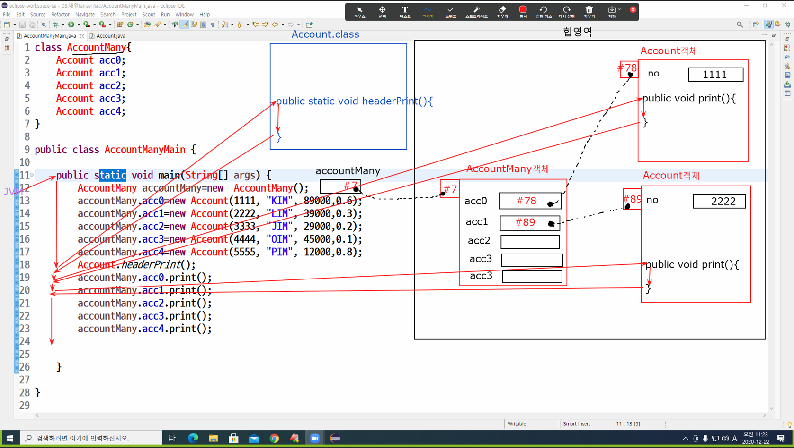

# 07. 자료를 순차적으로 한꺼번에 관리하는 방법 - 배열(array)

## 배열이란?

- 동일한 자료형의 순차적 자료 구조
- 인덱스 연산자[]를 이용하여 빠른 참조가 가능
- 물리적 위치와 논리적 위치가 동일
- 배열의 순서는 0부터 시작
- 자바에서는 객체 배열을 구현한 ArrayList를 많이 활용함
- 모든 배열[]형의 변수는 참조변수이다.(배열은 객체다.)
- 길이가 고정되어있다. 


## 기본형배열 사용

- 1.기본형배열 선언 & 기본형배열객체생성하기
```
  기본형데이타타입[] 변수이름=new 기본형데이타타입[ 배열갯수 ];
  int[] intArray = new int[5];
```


- 2.기본타입 배열 초기화 하기
 
  - 기본타입 배열은 배열객체생성과 동시에 자료형에 따라 초기화 됨 ( 정수는 0, 실수는 0.0, 객체는 null)
  - 필요에 따라 초기값을 지정할 수 있음

```java
int[] numbers = new int[] {10, 20, 30};  //개수 생략해야 함
int[] numbers = {10, 20, 30};            // new int[]  생략 가능

int[] numbers;                           //컴파일에러
numbers = {10, 20, 30};
    
int[] numbers; 
numbers = new int[] {10, 20, 30};        // 선언후 배열을 생성하는 경우는 new int[] 생략할 수 없음
```


- 기본타입 배열 사용하기

  + [] 인덱스 연산자 활용 - 배열 요소가 저장된 메모리의 위치를 연산하여 찾아 줌
  + 배열을 이용하여 총점,평균을 구하기

```java
public class PrimitiveTypeArrayMain {

	public static void main(String[] args) {
		System.out.println("---------int[]---------");
			int[] korArray=new int[10];
			korArray[0] = 89;korArray[1] = 56;korArray[2] = 99;korArray[3] = 78;korArray[4] = 10;
			korArray[5] = 100;korArray[6] = 23;korArray[7] = 71;korArray[8] = 65;korArray[9] = 29;int korTot=0;
			for(int i=0;i<korArray.length;i++) {
				korTot+=korArray[i];
			}
			System.out.println("우리반국어총점:"+ korTot);
			double korAvg = (double)korTot/korArray.length;
			System.out.println("우리반국어평균:"+ korAvg);
		}
}
```


- 문자 배열을 만들어 A-Z 까지 배열에 저장하고 이를 다시 출력하기
```java
public class CharArrayTest {

	public static void main(String[] args) {

		char[] alpahbets = new char[26];
		char ch = 'A';
		
		for(int i = 0; i<alpahbets.length; i++) {
			
			alpahbets[i] = ch++;
		}
		
		for(int i = 0; i<alpahbets.length; i++) {
			System.out.println(alpahbets[i] +","+ (int)alpahbets[i]);
		}
	}

}
```

- 향상된 for문 사용하기<br>
  배열의 n개 요소를 0 부터 n-1까지 순차적으로 순회할 때 간단하게 사용할 수 있음

```java
for( 기본타입변수 : 배열) {
    //배열의 요소를 0 번부터 순차적으로 변수에 대입해준다.
}

for( int kor : korArray) {
     /*
      	int kor = korArray[0];
     	int kor = korArray[1];
         ..
	int kor = korArray[n];
     */
     System.out.println(kor); 	
}
```


```java
public class CharArrayTest {

	public static void main(String[] args) {

		char[] alpahbets = new char[26];
		char ch = 'A';
		
		for(int i = 0; i<alpahbets.length; i++) {
			
			alpahbets[i] = ch++;
		}
		
		for(char alpha : alpahbets) {
			System.out.println(alpha +","+ (int)alpha);
		}

	}

}
```

- 기본타입 배열 실행 그림

```java
public class PrimitiveTypeArrayMain {

	public static void main(String[] args) {
		int intType;
		intType=90;
		
		int[] intArray;
		intArray = new int[5];
		System.out.println("intArray배열객체주소값:"+ intArray);
		
		intArray[0] = 11;
		intArray[1] = 22;
		intArray[2] = 33;
		intArray[3] = 44;
		intArray[4] = 55;
		
		System.out.println(intArray[0]);
		System.out.println(intArray[1]);
		System.out.println(intArray[2]);
		System.out.println(intArray[3]);
		System.out.println(intArray[4]);
		int length = intArray.length;
		System.out.println("intArray객체의 멤버필드수:"+length);
		
		for(int i=0;i<intArray.length;i++) {
			System.out.println(intArray[i]);
		}
	}
}
```


<br>
<hr>
<br>

## 참조객체포함관계




##  참조형(객체)배열 사용
- 참조형배열 선언 & 참조형배열객체생성하기
```
  데이타타입[] 변수이름=new 타입[ 배열갯수 ];
```
```java
  Account[] accountArray = new Account[5];
```

- 참조 배열 초기화 하기
  - 배열은 배열객체생성과 동시에 자료형에 따라 초기화 됨 ( 정수는 0, 실수는 0.0, 객체는 null)
  - 필요에 따라 초기값을 지정할 수 있음
    
```java
public class ReferenceTypeArrayMain {
	public static void main(String[] args) {
		Account[] accountArray = new Account[5]; 
	}
}
```


- 참조 배열 멤버필드에 객체주소대입하기
  ```java
	public class ReferenceTypeArrayMain {
		public static void main(String[] args) {
			Account[] accountArray = new Account[5];
  			accountArray[0] = new Account(1, "KIM", 30000, 0.3);
			accountArray[1] = new Account(2, "LEE", 45000, 4.2);
			accountArray[2] = new Account(3, "MIN", 78000, 3.8);
			accountArray[3] = new Account(4, "NIM", 92000, 2.9);
			accountArray[4] = new Account(5, "OIM", 81000, 1.7);
		}
	}
  ```
  


- 배열 실행 그림
  
```java
	public class ReferenceTypeArrayMain {
		public static void main(String[] args) {
		
			Account[] accountArray = new Account[5]; 
			accountArray[0] = new Account(1, "KIM", 30000, 0.3);
			accountArray[1] = new Account(2, "LEE", 45000, 4.2);
			accountArray[2] = new Account(3, "MIN", 78000, 3.8);
			accountArray[3] = new Account(4, "NIM", 92000, 2.9);
			accountArray[4] = new Account(5, "OIM", 81000, 1.7);
			
			Account.headerPrint();
			accountArray[0].print();
			accountArray[1].print();
			accountArray[2].print();
			accountArray[3].print();
			accountArray[4].print();
			System.out.println("-----------for loop-------------");
			for (int i = 0; i < accountArray.length; i++) {
				accountArray[i].print();
			}
		}
	}
```


